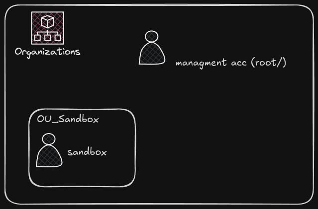

# AWS Organizations Bootstrap



Este projeto utiliza OpenTofu para provisionar a estrutura inicial de uma AWS Organization.

## Recursos criados

- Cria uma Organizational Unit (OU) chamada `OU_Sandbox`.
- Cria uma conta AWS `sandbox` dentro da OU.
- Configura a role padrão `OrganizationAccountAccessRole` para administração da conta pela Management Account.

## Pré-requisitos

- Uma AWS Organization já criada e configurada.
- Credenciais com permissões para gerenciar AWS Organizations.
- OpenTofu instalado.

## Estrutura

```
.
├── data.tf
├── main.tf
├── providers.tf
├── terraform.tfvars
├── variables.tf
```

## Variáveis

| Nome | Descrição |
|------|-----------|
| `acc_email` | Endereço de e-mail da nova conta Sandbox. |

## Como utilizar

Inicialize o projeto:

```bash
tofu init
```

Visualize as alterações:

```bash
tofu plan
```

Aplique a infraestrutura:

```bash
tofu apply
```

## Observações

- Este projeto **não cria** uma AWS Organization. Ele utiliza uma Organization já existente.
- A conta Sandbox é criada dentro da OU `OU_Sandbox`.
- A exclusão deste projeto (`tofu destroy`) **não remove** a conta AWS criada, pois a AWS não permite excluir contas via API. O recurso será removido apenas do estado do OpenTofu.

## Objetivo

Este projeto faz parte de um conjunto de laboratórios para estudo de Infrastructure as Code (IaC) e AWS Organizations.
